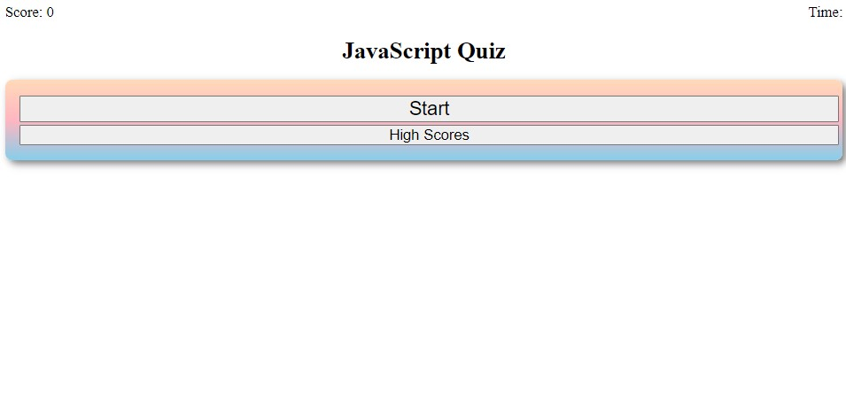
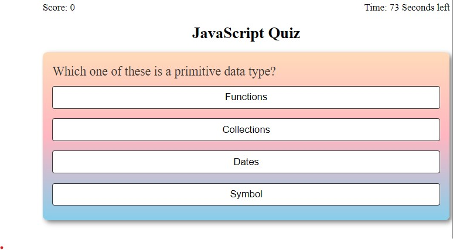
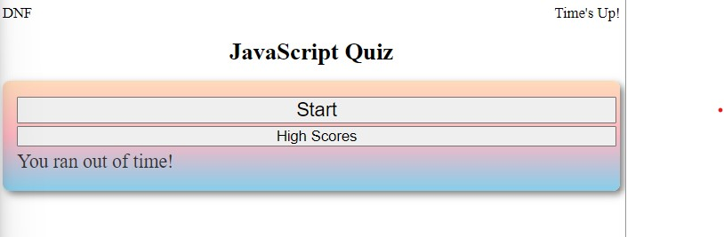
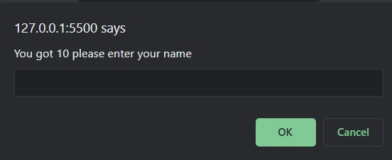
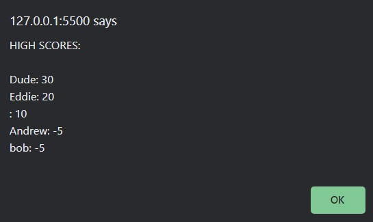

# Javascript-Pop-Quiz

## This is a simple quiz using JavaScript, HTML, and CSS to test your knowledge on JavaScript.

# Getting Started
## To get started, use the link provided to access the quiz.

# Usage
## Once on the landing page click the "Start" button to begin the quiz.
## You will be presented with ten multiple choice questions. Select the answer you believe is correct by clicking on the corresponding answer.
## For each correct answer, you will earn 10 points. FOr each incorrect answer, you will lose 5 points.
## You will have 75 seconds to complete the quiz. If you run out of time, the game will end in Did not finish (DNF).
## At the end of the quiz, you will be prompted to enter you name. Your score will be saved and will be there if you would return at another time.
## You can view your high scores by clicking on the High Scores button.

# Features
## The answer choices will be randomly generated so that the quiz will never look the same on multiple attempts.

# Screenshots
## Landing Page

# Resources Used
* [w3chools](https://www.w3schools.com/default.asp)
* [freecodecamp](https://www.freecodecamp.org/)

# Credits
## This quiz was created by Andrew Hur

# Link
[Deployed GitHub Page](https://athur1104.github.io/Javascript-Pop-Quiz/)